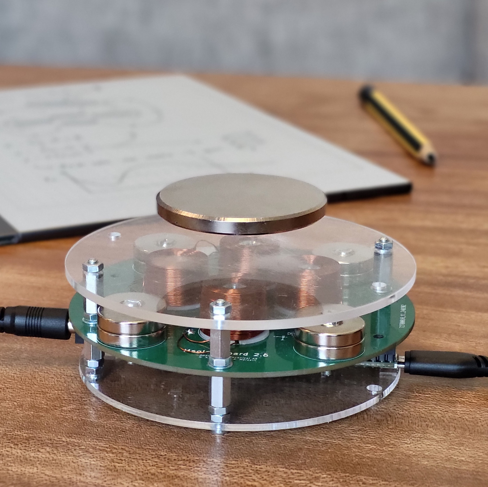
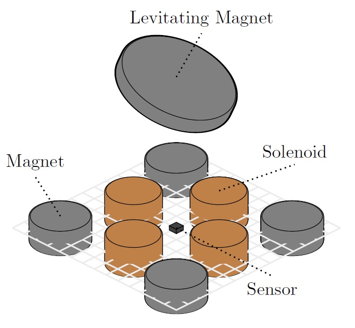

This repository is a partial fork of github user hansolini's Take-home-maglev-lab repository, where only information pertaining strictly to the "Maggy" hardware has been preserved. Students working on this project have done a significant amount of work, including several theses. Their work is currently preserved in the originial repository.

# Take-home Maglev lab \:magnet\:

<table align="center">
  <tr>
    <td align="center">
       
      1) Version 2.6 of the lab.
    </td>
    <td align="center">
       
      2) Illustration of the system.
    </td>
  </tr>
</table>

The "Take-home Maglev lab" is a small lab in development at the Norwegian University of Science and Technology (NTNU) tailored to students in control and related fields. It is intended as a kit that students can bring home and assemble independently, with additional lab assignments for teaching anything from fundamental to advanced concepts within control engineering.

See [the wiki](https://www.ntnu.no/wiki/x/OYSyEw) for more information on the project.

This repository contains a
- **[MATLAB simulator](./simulation):** Implementation of several models with examples, see [main.mlx](./simulation/main.mlx) for how to use it.
- **[Design files & software](./physical_system):** PCB files, test code, and example usage for the physical system.
- **[Student contributions](./student_contributions):** Code and project reports from student projects.

## Development history \:rocket\:
| **Version** | **Developer**                                                  | **Goal**                                                      | **Development period** |      **Status**      | **Result**                  |
| ----------- | -------------------------------------------------------------- | ------------------------------------------------------------- | ---------------------- | :------------------: | --------------------------- |
| V1.0        | M. Brønstad   J. O. Deila   J. Dyrskog   M. Langklopp | Levitaion                                                     | Spring 2022            | \:white_check_mark\: | Stable levitation ~ 2 min   |
| V2.0        | M. Brønstad   J. O. Deila   J. Dyrskog                   | Smaller form factor, more robust                              | Summer 2022            | \:white_check_mark\: | Stable levitation >> 2 min  |
| V2.5        | JH Technical AS                                                | Fix minor bugs, improve heating and components                | Spring 2024            | \:white_check_mark\: | Stable levitation >> 2 min  |
| V2.6        | A. Morselli                                                    | Fix faulty wiring, changing sensors                           | Spring 2024            | \:white_check_mark\: | Stable levitation >> 30 min |
| V2.7        | A. Morselli                                                    | Modular design and testbench for V3.0                         | Spring 2024            | \:white_check_mark\: | Decisions on design         |
| V3.0        | A. Morselli                                                    | Modular redesign for first 'Take-home lab'                    | Summer 2024            | \:white_check_mark\: | Decisions on design         |
| V3.1        | M. Leroux                                                      | Adding USB-C power                                            | Fall 2024              | \:white_check_mark\: | Improved power delivery     |
| V4.0        | M. Leroux                                                      | New form factor and additional sensing for improved stability | Fall 2024              | \:white_check_mark\: | Improved control            |
| V4.1        | R. Antonello                                                   | Rerouting PCB tracks and updating components                  | Spring 2025            | \:white_check_mark\: | Meets IPC standards         |
